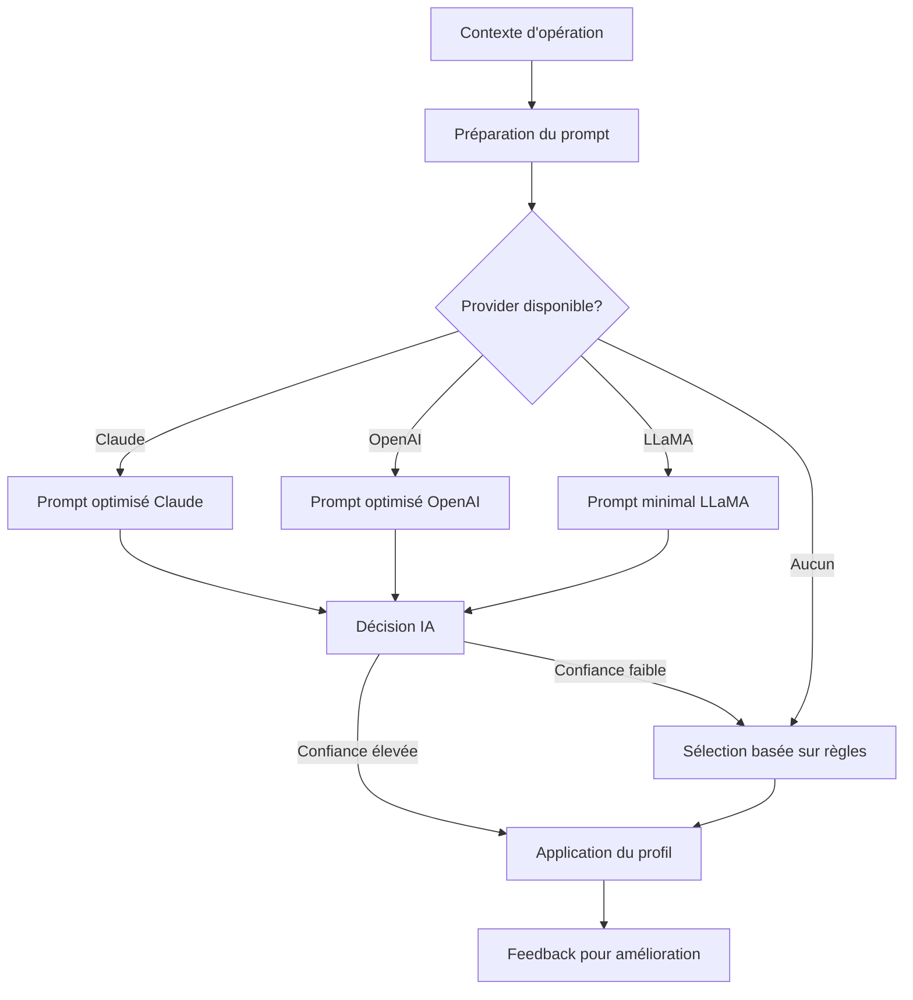

# Gestion Intelligente des Profils de Trading par IA

## Introduction

Le système de gestion intelligente des profils de trading est l'une des fonctionnalités les plus avancées du GBPBot. Il permet aux différentes IA intégrées (Claude, OpenAI, LLaMA) de gérer automatiquement les profils utilisés par le système anti-détection, optimisant ainsi l'équilibre entre discrétion et performance pour maximiser les profits tout en minimisant les risques de détection.

## Objectifs

- **Maximiser les profits** en sélectionnant le profil de trading optimal pour chaque opération
- **Réduire les risques de détection** en adaptant le comportement du bot aux conditions du marché
- **Automatiser la gestion** des profils sans nécessiter d'intervention humaine
- **Équilibrer discrétion et performance** selon les préférences et le contexte
- **S'adapter dynamiquement** aux niveaux de risque de chaque blockchain

## Architecture

L'architecture du système de gestion intelligente des profils comprend les composants suivants:

1. **Module ProfileIntelligence**
   - Cœur du système qui coordonne la sélection intelligente des profils
   - Interface avec les différents modèles d'IA (Claude, OpenAI, LLaMA)
   - Gestion des décisions et cache pour optimiser les performances

2. **Système de surveillance des blockchains**
   - Suivi des niveaux de risque sur chaque blockchain
   - Détection des événements de détection potentielle
   - Mise à jour dynamique des statistiques

3. **Modèles d'IA et sélection automatique**
   - Interface unifiée pour tous les modèles d'IA
   - Sélection automatique du provider selon la disponibilité
   - Adaptation des prompts selon les capacités de chaque modèle

4. **Intégration avec le système anti-détection**
   - Communication directe avec le StealthManager
   - Application des profils sélectionnés aux transactions
   - Feedback des résultats pour amélioration continue

## Profils de Trading Disponibles

Le système utilise plusieurs profils de trading prédéfinis, chacun optimisé pour des scénarios spécifiques:

| Profil | Description | Cas d'utilisation optimal |
|--------|-------------|---------------------------|
| `beginner_trader` | Profil conservateur avec des transactions simples et prévisibles | Situations à haut risque, détection imminente |
| `intermediate_trader` | Équilibre entre performance et discrétion | Opérations standard sur la plupart des blockchains |
| `expert_trader` | Profil agressif pour maximiser les profits | Conditions favorables, faible risque de détection |
| `solana_meme_sniper` | Spécialisé dans le sniping ultra-rapide de memecoins | Sniping de nouveaux tokens sur Solana |
| `avax_arbitrageur` | Optimisé pour l'arbitrage sur AVAX | Opérations d'arbitrage entre DEX sur Avalanche |
| `whale_tracker` | Profil pour suivre les mouvements des whales | Copie des transactions des gros portefeuilles |

## Configuration

Le système de gestion intelligente des profils peut être configuré via le fichier `.env.local`:

```env
# Activer/désactiver la gestion automatique des profils
AI_PROFILE_MANAGEMENT=true

# Équilibre performance/discrétion (0.0-1.0)
# 0.0 = discrétion maximale, 1.0 = performance maximale
PERFORMANCE_PRIORITY=0.7

# Provider IA à utiliser (auto, claude, openai, llama)
AI_PROVIDER=auto

# Clés API pour les différents providers
CLAUDE_API_KEY=your_api_key
OPENAI_API_KEY=your_api_key
LLAMA_MODEL_PATH=/path/to/model.gguf

# Seuils de risque par blockchain (0.0-1.0)
# Ces valeurs peuvent être ajustées dans le fichier anti_detection_config.json
```

## Utilisation

Le système fonctionne de manière entièrement automatique et ne nécessite pas d'interaction directe. Cependant, vous pouvez ajuster son comportement en modifiant les paramètres de configuration.

### Exemples concrets

#### Scénario 1: Sniping sur Solana

Lorsque le GBPBot détecte un nouveau token prometteur sur Solana, le système d'intelligence de profil analyse:
- Le niveau de risque actuel sur Solana
- Les caractéristiques du token
- L'historique des détections précédentes

Si le risque est faible et que votre priorité est la performance, il sélectionnera le profil `solana_meme_sniper` pour une entrée ultra-rapide. Si des signes de détection apparaissent, il basculera dynamiquement vers un profil plus discret.

#### Scénario 2: Arbitrage à faible risque

Pour une opportunité d'arbitrage sur AVAX avec un grand écart de prix, le système sélectionnera:
- Le profil `avax_arbitrageur` si la priorité est la performance
- Le profil `intermediate_trader` si un équilibre est souhaité
- Le profil `beginner_trader` si la discrétion est critique

## Mécanismes de Décision

### Règles de Sélection

Le système utilise plusieurs facteurs pour sélectionner le profil optimal:

1. **Niveau de risque de la blockchain**
   - Chaque blockchain a un seuil de risque configurable
   - Le système surveille les événements de détection et les échecs de transactions

2. **Type d'opération**
   - Les opérations de sniping nécessitent généralement plus de performance
   - Les opérations d'arbitrage nécessitent un équilibre
   - Les opérations standard peuvent privilégier la discrétion

3. **Priorité performance/discrétion**
   - Paramètre configurable par l'utilisateur
   - Impact important sur les décisions du système

4. **Historique des sélections**
   - Évite les changements trop fréquents qui pourraient créer des patterns
   - Maintient une cohérence dans le comportement du bot

### Intégration IA

Le système utilise les IA pour prendre des décisions plus nuancées:



## Statistiques et Suivi

Le système maintient des statistiques détaillées sur ses décisions:

- Nombre de sélections basées sur l'IA vs règles
- Nombre de changements de profil
- Risque de détection par blockchain
- Historique des décisions avec justifications

Ces statistiques peuvent être consultées via les logs ou le système de monitoring du GBPBot.

## Limitations et Améliorations Futures

### Limitations actuelles

- Le système dépend de la qualité des données d'entrée pour prendre des décisions optimales
- La surveillance des niveaux de risque pourrait être affinée avec plus de signaux
- Les profils prédéfinis ne couvrent pas tous les scénarios possibles

### Roadmap d'améliorations

- **Apprentissage par renforcement**: Permettre au système d'apprendre de ses succès et échecs
- **Création dynamique de profils**: Générer des profils entièrement nouveaux adaptés à des situations spécifiques
- **Analyse comportementale avancée**: Détecter et imiter plus finement les comportements humains
- **Intégration de données externes**: Utiliser des sources externes pour évaluer les niveaux de risque

## Conclusion

Le système de gestion intelligente des profils par IA est un élément clé de la stratégie du GBPBot pour maximiser les profits tout en restant indétectable. En équilibrant parfaitement discrétion et performance, il permet d'exploiter pleinement les opportunités du marché sans compromettre la sécurité des opérations.

En combinant des règles prédéfinies avec l'intelligence artificielle avancée, le système offre une approche adaptative qui s'ajuste dynamiquement aux conditions changeantes du marché et aux niveaux de risque, garantissant ainsi des performances optimales dans toutes les situations.

## FAQ

**Q: Le système peut-il fonctionner sans IA?**
R: Oui, il existe un mode de fallback basé sur des règles qui est utilisé si aucun provider IA n'est disponible.

**Q: Comment ajuster l'équilibre entre performance et discrétion?**
R: Modifiez le paramètre `PERFORMANCE_PRIORITY` dans votre configuration (0.0 = discrétion max, 1.0 = performance max).

**Q: Puis-je créer mes propres profils de trading?**
R: Oui, vous pouvez ajouter des profils personnalisés dans le fichier `trader_profiles.json`.

**Q: Quelle IA est la plus efficace pour la gestion des profils?**
R: Claude tend à donner les meilleurs résultats grâce à sa compréhension contextuelle supérieure, mais tous les providers sont efficaces.

**Q: Comment savoir quel profil a été sélectionné pour une transaction?**
R: Consultez les logs du GBPBot qui indiquent le profil sélectionné pour chaque opération, avec la justification de l'IA. 